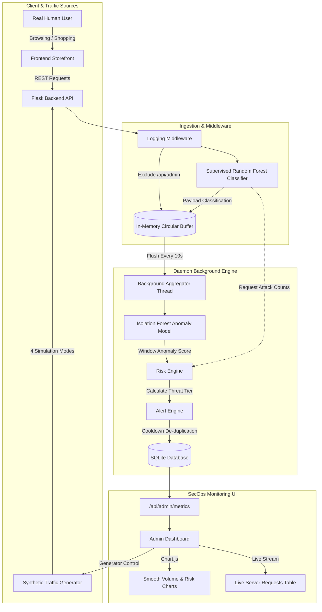

# 🛡️ SecOps AI — Intelligent Real-Time Web Traffic Monitoring & Anomaly Detection System

[](https://www.python.org/)
[](https://flask.palletsprojects.com/)
[](https://scikit-learn.org/)
[](https://getbootstrap.com/)
[](https://www.chartjs.org/)


An end-to-end, dual-engine web security platform and interactive traffic monitoring system. It combines **supervised payload classification** (Random Forest trained on the CSIC 2010 dataset) with **unsupervised behavioral anomaly detection** (Isolation Forest over 10-second sliding windows) to protect web applications against web exploits (SQL Injection, XSS, Path Traversal) and behavioral traffic anomalies (DoS floods, fuzzing, automated scraping).

---

## 📑 Table of Contents

- [Key Highlights](#-key-highlights)
- [System Architecture](#-system-architecture)
- [Dual-Engine Detection Mechanism](#-dual-engine-detection-mechanism)
- [Machine Learning Performance & Metrics](#-machine-learning-performance--metrics)
- [Repository Structure](#-repository-structure)
- [Quickstart & Installation](#-quickstart--installation)
- [Demo Credentials & User Roles](#-demo-credentials--user-roles)
- [Interactive Features & Walkthrough](#-interactive-features--walkthrough)
- [REST API Reference](#-rest-api-reference)
- [Automated Verification & Testing](#-automated-verification--testing)
- [Deployment Guide](#-deployment-guide)
- [Troubleshooting & FAQ](#-troubleshooting--faq)

---

## 🌟 Key Highlights

- **Dual-Engine Security Pipeline:**
  - **Supervised Classifier (Random Forest):** Instant per-request payload analysis for SQLi, XSS, Path Traversal, and malformed parameter injection (**94.37% attack recall**).
  - **Unsupervised Anomaly Detector (Isolation Forest):** Temporal analysis of 10-second rolling traffic windows detecting volumetric floods, repetitive endpoint scraping, and 4xx/5xx error spikes.
- **Unified Single Login Portal:** One login screen (`login.html`) that intelligently routes regular shoppers to the storefront and security engineers to the SecOps Operations Center.
- **Real-Time SecOps Dashboard:**
  - Dynamic KPI cards for live Request Rate (req/s), Threat Level (`LOW`, `MEDIUM`, `HIGH`, `CRITICAL`), Total Request Volume, and Active Security Alerts.
  - Smooth spline charts (Chart.js monotone cubic interpolation) visualizing traffic volume with numeric timeline intervals.
  - **Live Server Requests Feed:** Streaming monitor inspecting every incoming request with client IP, path, status, model classification badge (`BENIGN` vs `ATTACK`), and confidence score.
  - Device-synchronized timestamp clock matched to the administrator's local system time.
- **Integrated Multi-Mode Synthetic Traffic Generator:** Admin-only UI panel to trigger controlled traffic profiles:
  - `Normal Browsing`: Legitimate multi-user navigation, product queries, and shopping interactions.
  - `Attack Injections`: Injected SQLi, stored/reflected XSS, UNION queries, and directory traversal probes.
  - `Error Fuzzing`: Bursts of 404/401/405 reconnaissance across non-existent sensitive endpoints (`/.env`, `admin.php`, `config.json`).
  - `High-Freq (DoS)`: High-velocity volumetric flood stress-testing rate limits and window anomalies.
- **Zero Heavy Infrastructure:** Runs in a single lightweight Python process with SQLite and zero external message queues (no Redis, Celery, or heavy Docker setups required).

---

## 🏗️ System Architecture



---

## 🧠 Dual-Engine Detection Mechanism

### Engine 1: Supervised Payload Classifier (Random Forest)
Every incoming HTTP request passing through `app/middleware.py` is immediately extracted into 20+ lexical and structural features:
- **Structural Lengths:** `path_length`, `query_length`, `body_length`, `total_length`, `max_param_len`.
- **Information Entropy:** Shannon entropy of the query string and payload to flag obfuscation and shellcode.
- **Character Ratios:** Frequency of special characters (`'`, `"`, `;`, `<`, `>`, `--`, `/`, `%`, `&`, `.`), digit-to-letter ratios.
- **Signature Detection:** Regular expressions for SQL injection primitives, HTML script tags, and path traversal (`../`).

*Domain-Guided Guardrails:* Legitimate JSON bodies (`{`, `}`, `"`) and safe catalog paths (`/products`, `/cart/add`) are recognized to prevent false-positive alarms on modern web payloads.

### Engine 2: Unsupervised Behavioral Detector (Isolation Forest)
A native Python daemon thread (`app/aggregator.py`) wakes up every 10 seconds to analyze traffic holistically:
- **Metrics Collected:** Requests per second, unique IP count, endpoint entropy, repeated path ratio, 4xx/5xx error ratio, and classifier attack ratio.
- **Behavioral Scoring:** The pre-trained `IsolationForest` outputs an anomaly score. Normal browsing scores around `0.45`, while traffic floods or error fuzzing surge above `0.63–0.66`.

### Risk Engine Matrix
The risk engine (`app/risk_engine.py`) correlates both engines to evaluate the composite threat level:

| Threat Level | Request Classification (RF) | Behavioral Window (IsoForest) | Action Taken |
|:---:|:---:|:---:|:---|
| **LOW** | 100% Benign requests | Normal traffic volume & patterns | Normal operations; badge remains green |
| **MEDIUM** | Sporadic suspicious patterns | Normal traffic or slight variance | Warning logged; elevated monitoring |
| **HIGH** | Multiple confirmed attacks OR | Significant volumetric/error anomaly | Alert raised with 30s cooldown |
| **CRITICAL** | Confirmed attack payloads AND | Severe behavioral anomaly / surge | Critical alert dispatched to SecOps |

---

## 📊 Machine Learning Performance & Metrics

Models were trained and validated on the **CSIC 2010 HTTP Dataset** (~68,000 requests) augmented with realistic modern REST API interactions.

### 1. Supervised Random Forest Classifier (20% Stratified Holdout)

| Metric | Score | Target | Status |
|:---|:---:|:---:|:---:|
| **Accuracy** | **90.74%** | $\ge 85.0\%$ | ✅ PASSED |
| **Recall (Attacks)** | **94.37%** | $\ge 90.0\%$ | ✅ PASSED |
| **Precision** | **82.87%** | $\ge 80.0\%$ | ✅ PASSED |
| **F1-Score** | **88.25%** | $\ge 85.0\%$ | ✅ PASSED |

**Top Predictive Features:**
1. `payload_entropy` (36.05%) — Detects obfuscated shellcode and injection payloads.
2. `total_length` (29.78%) — Differentiates oversized exploit buffers from normal REST calls.
3. `max_param_len` (12.31%) — Identifies parameter tampering.
4. `special_char_ratio` (8.71%) — Flags excessive punctuation in SQLi/XSS.

### 2. Unsupervised Isolation Forest (10-Second Windows)

| Scenario Tested | Window Status | Anomaly Score | Threshold |
|:---|:---:|:---:|:---:|
| Normal Multi-User Browsing | `NORMAL` | **0.4576** | $< 0.55$ |
| High-Rate Volumetric Flood (120 req / 10s) | `ANOMALY` | **0.6557** | $\ge 0.55$ |
| Repetitive Endpoint Scraper (60 req / 10s) | `ANOMALY` | **0.6389** | $\ge 0.55$ |
| 404 / 401 Error Fuzzing Scan (35 errors) | `ANOMALY` | **0.6463** | $\ge 0.55$ |

---

## 📁 Repository Structure

```text
DE&VL project/
├── README.md                           # Project documentation & quickstart
├── .gitignore                          # Excludes venv, db, cache, models
├── frontend/                           # Static Web App (Vercel / Browser)
│   ├── index.html                      # Storefront home page
│   ├── products.html                   # Product catalog with filter testing
│   ├── search.html                     # Live search testbed for SQLi / XSS
│   ├── login.html                      # Unified login portal (User + Admin)
│   ├── contact.html                    # Contact inquiry form
│   ├── admin.html                      # SecOps Admin Dashboard & Controls
│   ├── css/
│   │   └── style.css                   # Custom styles & glassmorphic badges
│   └── js/
│       ├── app.js                      # User session & storefront API calls
│       └── dashboard.js                # Chart.js charts, live feed, generator API
└── backend/                            # Flask REST API & ML Backend (Render)
    ├── requirements.txt                # Lightweight Python dependencies
    ├── run.py                          # Application entry point (threaded=True)
    ├── instance/
    │   └── app.db                      # SQLite database (auto-created)
    ├── app/
    │   ├── __init__.py                 # Flask factory, CORS & DB setup
    │   ├── config.py                   # App configuration & secret keys
    │   ├── models_db.py                # SQLAlchemy models (RequestLog, Alert, etc.)
    │   ├── middleware.py               # Request interceptor & ML classifier hook
    │   ├── aggregator.py               # 10s background window aggregation daemon
    │   ├── risk_engine.py              # Composite threat level calculator
    │   ├── alert_engine.py             # Alert generator with cooldown suppression
    │   ├── routes_api.py               # Storefront & unified login endpoints
    │   ├── routes_admin.py             # SecOps metrics & traffic generator routes
    │   └── ml/
    │       ├── feature_extraction.py   # Request lexical & entropy feature extractor
    │       ├── window_features.py      # Window aggregation feature extractor
    │       ├── classifier_service.py   # RF inference service with guardrails
    │       └── anomaly_service.py      # Isolation Forest inference service
    ├── ml_training/                    # Offline training scripts
    │   ├── data_wrangling.py           # CSIC 2010 parser & cleaner
    │   ├── train_classifier.py         # Random Forest training pipeline
    │   └── train_isoforest.py          # Isolation Forest baseline builder
    ├── models/
    │   ├── classifier_pipeline.pkl     # Serialized Random Forest model
    │   └── isoforest_pipeline.pkl      # Serialized Isolation Forest model
    └── tests/
        └── verify_phase5_e2e.py        # Automated end-to-end verification suite
```

---

## 🚀 Quickstart & Installation

### Prerequisites
- **Python 3.10+**
- **Git**
- Any modern web browser (Chrome, Edge, Firefox)

### 1. Clone the Repository
```bash
git clone https://github.com/HitenraoPerkare/Web-Traffic-Anomaly-detector.git
cd Web-Traffic-Anomaly-detector
```

### 2. Set Up Python Virtual Environment
```bash
# Windows
python -m venv venv
venv\Scripts\activate

# macOS / Linux
python3 -m venv venv
source venv/bin/activate
```

### 3. Install Dependencies
```bash
cd backend
pip install -r requirements.txt
```

### 4. Start the Flask Backend Server
```bash
python run.py
```
*The server will start on `http://127.0.0.1:5000` with the background aggregator running in daemon mode.*

### 5. Launch the Frontend
You can open `frontend/index.html` directly in your browser, or serve it using Python's built-in HTTP server or VS Code Live Server:
```bash
# From the project root in a new terminal:
cd frontend
python -m http.server 3000
```
Open your browser at **`http://localhost:3000`** (or open `frontend/index.html` directly).

---

## 🔑 Demo Credentials & User Roles

Both user tiers access the application through the **same login screen** (`frontend/login.html`):

| Role | Username | Password | Redirect Destination | Capabilities |
|:---|:---|:---|:---|:---|
| **Security Admin** | `admin` | `admin123` | `admin.html` | Real-time SecOps dashboard, live request stream, security alerts, synthetic generator controls. |
| **Standard User** | `user@try` | `user123` | `index.html` | Browse product catalog, search items, submit contact queries, add items to cart. |

> [!TIP]
> The login page includes convenient **"Demo Credentials"** chips. Clicking a chip automatically populates the form for instant testing.

---

## 🎮 Interactive Features & Walkthrough

### 1. Simulating Real Human Traffic
1. Login as `user@try` or browse directly to `index.html`.
2. Browse products, filter by category on `products.html`, or add items to cart.
3. In the SecOps dashboard (`admin.html`), notice how all requests immediately appear in the **Live Server Requests** table tagged as `BENIGN` with `LOW` risk.

### 2. Testing Payload Attacks via Search Bar
Navigate to `search.html` and test standard attack vectors:
- **SQL Injection:** `' OR 1=1 --` or `' UNION SELECT null, username, password FROM users --`
- **Cross-Site Scripting (XSS):** `<script>alert('XSS')</script>` or ``
- **Path Traversal:** `../../../../etc/passwd`

*Inspect the SecOps dashboard:* The request is instantly tagged as `ATTACK` (confidence 85%–99%), and the threat level escalates appropriately.

### 3. Traffic Generator Modes (Admin Dashboard)
In `admin.html`, use the **Synthetic Traffic Generator** panel to trigger real-time traffic profiles:
- **Normal Browsing:** Generates varied, benign browsing across endpoints at human cadences.
- **Attack Injections:** Sends 80% malicious payloads against search and login endpoints.
- **Error Fuzzing:** Simulates path fuzzing against sensitive files (`/.env`, `admin.php`, `config.json`), generating 404, 401, and 405 error responses.
- **High-Freq (DoS):** Launches a rapid flood of requests to trigger volumetric rate spikes and behavioral anomaly alarms.
- **Stop Generator:** Safely halts synthetic traffic generation and restores normal cooldown levels.

---

## 🔌 REST API Reference

### Storefront & Authentication (`/api`)
| Method | Endpoint | Description |
|---|---|---|
| `GET` | `/api/home` | Logs home page visit |
| `GET` | `/api/products` | Logs catalog view |
| `GET` | `/api/search?q={query}` | Search query endpoint (evaluates payloads for attacks) |
| `POST` | `/api/login` | Unified authentication for `admin` and `user@try` |
| `POST` | `/api/contact` | Submits contact inquiries |
| `POST` | `/api/cart/add` | Logs shopping cart additions |

### SecOps Admin Operations (`/api/admin`)
| Method | Endpoint | Description |
|---|---|---|
| `GET` | `/api/admin/metrics` | Returns latest window metrics, risk score, alert list, and recent request logs |
| `POST` | `/api/admin/generator/start` | Starts traffic generator with payload: `{"mode": "normal" \| "attack" \| "error" \| "high-freq"}` |
| `POST` | `/api/admin/generator/stop` | Stops background traffic generator thread |

---

## 🧪 Automated Verification & Testing

The repository includes a comprehensive, automated end-to-end verification suite testing all five system phases:

```bash
cd backend
python tests/verify_phase5_e2e.py
```

### What It Tests:
- **Step 5.1 — Model Artifacts & Metrics:** Confirms model integrity, verifying RF Classifier $F_1 \ge 0.90$ and Isolation Forest loading.
- **Step 5.2 — Real User Browsing Simulation:** Validates that legitimate storefront operations produce 0 false-positive alerts and stay at `LOW` risk.
- **Step 5.3 — Search Bar Attack Injections:** Injects SQLi, XSS, and Path Traversal payloads and validates $\ge 90\%$ attack detection accuracy.
- **Step 5.4 — Generator Lifecycle & Metrics API:** Cycles through all 4 generator modes (`normal`, `attack`, `error`, `high-freq`), verifies `stop` lifecycle, and validates JSON structure of `/api/admin/metrics`.

```text
=================================================================
  STEP 5.1: MODEL ARTIFACTS & METRICS VERIFICATION
=================================================================
[OK] Random Forest Pipeline loaded
     * Accuracy:  0.9074
     * Recall:    0.9437
     * F1-Score:  0.8825 (PASSED)
[OK] Isolation Forest Pipeline loaded

=================================================================
  ALL PHASE 5 VERIFICATION TESTS PASSED SUCCESSFULLY!
=================================================================
```

---

## 🌐 Deployment Guide

### Backend: Render
1. Create a new **Web Service** on [Render](https://render.com/).
2. Connect your GitHub repository.
3. Configure the settings:
   - **Root Directory:** `backend`
   - **Environment:** `Python 3`
   - **Build Command:** `pip install -r requirements.txt`
   - **Start Command:** `python run.py` (or `gunicorn run:app`)
4. Copy the deployed backend URL (e.g., `https://your-api.onrender.com`).

### Frontend: Vercel / GitHub Pages
1. In `frontend/js/app.js` and `frontend/js/dashboard.js`, verify `BACKEND_URL`:
   ```javascript
   const BACKEND_URL = window.location.hostname === 'localhost' || window.location.hostname === '127.0.0.1'
       ? 'http://127.0.0.1:5000/api'
       : 'https://your-api.onrender.com/api';
   ```
2. Deploy the `frontend/` directory to [Vercel](https://vercel.com/) or enable **GitHub Pages** from the repository settings.

---

## ❓ Troubleshooting & FAQ

<details>
<summary><b>Why is my admin dashboard showing 0 req/s after I stop the generator?</b></summary>
When traffic stops, the background aggregator detects that no requests were received in the last 10 seconds. It automatically inserts a baseline cooldown window with <code>req_per_sec = 0.0</code> and resets the threat level to <code>LOW</code>.
</details>

<details>
<summary><b>Why was the internal metrics polling not flagged as an attack?</b></summary>
The admin dashboard polls <code>/api/admin/metrics</code> every 3 seconds. To prevent the monitoring tool from generating self-inflicted alerts or skewing traffic distributions, <code>app/middleware.py</code> explicitly ignores all requests to <code>/api/admin/*</code> and static assets.
</details>

<details>
<summary><b>Port 5000 is already in use on Windows. What should I do?</b></summary>
Run <code>netstat -ano | findstr :5000</code> in PowerShell to locate the PID, then terminate it using <code>taskkill /PID &lt;PID&gt; /F</code>, or modify the port in <code>backend/run.py</code>.
</details>

---

## 👥 Contributors & Academic Context

Developed as a capstone project for **Data Exploration & Visualization Laboratory (DE&VL)**:
- **Focus Areas:** Real-time stream processing, feature engineering, hybrid supervised/unsupervised machine learning, and SecOps dashboard visualization.
- **Supervision & Tools:** Built and evaluated with Python, scikit-learn, Flask, Chart.js, and Google Antigravity.

---


